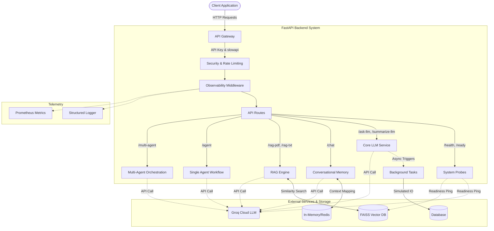

# 🏢 Enterprise Multi-Agent AI System with RAG Architecture

An enterprise-grade, highly scalable GenAI-powered backend application built using **FastAPI**, **Groq LLM**, **LangChain**, and **FAISS**. 

This system implements advanced Retrieval-Augmented Generation (RAG) pipelines, secure API gateways, multi-agent conversational workflows, and observability integrations designed for production readiness.

---

## 🚀 Enterprise Features

- **High-Performance API Gateway:** Built with FastAPI, featuring asynchronous endpoints and background task processing.
- **Robust Security:** Integrated API Key verification, CORS configuration, and endpoint rate-limiting (using `slowapi`) to prevent abuse and API quota exhaustion.
- **Observability & Telemetry:** Request tracking middleware (unique request IDs), structured logging, and Prometheus metrics instrumentation.
- **Advanced RAG Pipeline:** PDF and Text document ingestion, intelligent chunking, HuggingFace embeddings, and fast semantic search via local FAISS vector stores.
- **Multi-Agent Orchestration:** Complex workflow execution delegating tasks among specialized AI agents.
- **Conversational Memory:** Stateful interactions maintaining conversation context mapping.
- **Resiliency:** Standardized exception handlers, readiness probes, and fallback mechanisms.

---

## 🏗️ Architecture & Flow Diagram



---

## 🧠 Component Breakdown & Implemented Features

### 1. Core API & Gateway (`main.py`)
- **FastAPI Backend**: A fully asynchronous REST API application routing traffic to various AI functionalities.
- **Readiness & Health Probes**: Endpoints (`/health`, `/ready`) to check application uptime and verify live connections to external dependencies (Groq LLM and FAISS Vector DB).
- **Background Tasks**: Capabilities to run tasks off the main thread, such as simulating database interaction logging.

### 2. Security & Resiliency (`core/security.py`, `core/exceptions.py`)
- **API Key Authentication**: Custom security dependency (`verify_api_key`) to protect sensitive endpoints from unauthorized access.
- **Rate Limiting**: Implementation of `slowapi` to protect against DDoS and quota exhaustion (e.g., 60/min for health checks, 10/min for LLM queries).
- **Global Exception Handling**: Standardized JSON responses for internal server errors and payload validation errors to prevent app crashes and leakages.
- **CORS Configuration**: Configured to securely manage cross-origin frontend requests.

### 3. Observability & Telemetry (`utils/request_tracker.py`, `main.py`, `service/llm_service.py`)
- **Request Tracking Middleware**: Injects a unique `X-Request-ID` into every HTTP request, calculates `X-Process-Time`, and logs the lifecycle.
- **Prometheus Metrics**: Integrated `prometheus-fastapi-instrumentator` to expose a `/metrics` endpoint for dashboards like Grafana.
- **Token Tracking**: Custom Prometheus counters (`llm_tokens_total`) tracking exact LLM prompt and completion tokens.

### 4. LLM Integration (`service/llm_service.py`)
- **Groq Cloud Integration**: Configured both synchronous (`Groq`) and asynchronous (`AsyncGroq`) clients.
- **Execution Modes**: Implemented standard query (`ask_llm`), non-blocking async query (`ask_llm_async`), and streaming responses (`ask_llm_stream`).

### 5. Retrieval-Augmented Generation (RAG) (`service/rag_service_pdf.py`, `service/rag_service_txt.py`)
- **Document Loaders**: Integrated LangChain's `PyPDFLoader` for PDFs and standard text loaders for raw data.
- **Chunking & Embeddings**: Splits documents using `CharacterTextSplitter` with overlaps, then converts text to multidimensional vectors using `HuggingFaceEmbeddings`.
- **Vector Database**: Persists and queries embeddings locally using CPU-optimized `FAISS`.

### 6. Conversational Memory (`service/redis_memory_service.py`, `main.py`)
- **Stateful Chats**: A `/chat` endpoint that maintains conversation history context mapping.
- **Redis Integration**: Created a `RedisMemoryService` handling 24-hour TTL caching for distributed chat session tracking.

### 7. Multi-Agent Workflows (`service/agent_service.py`, `service/multi_agent_service.py`)
- **Single-Agent Routing**: A basic intelligent router that evaluates user intents (e.g., "calculate", "skills") to utilize specialized "tools" or fallback to the LLM.
- **Multi-Agent Orchestration**: A robust HR automation pipeline acting as three distinct agents working sequentially (Resume Analyzer -> Interview Question Generator -> HR Summary Agent).

---

## 🛠️ Steps to Follow (Local Implementation)

### Step 1: Prerequisites
Ensure you have **Python 3.9+** installed on your system.

### Step 2: Environment Setup
Create an isolated virtual environment and activate it:
```bash
python -m venv venv

# On Windows:
.\venv\Scripts\activate

# On macOS/Linux:
source venv/bin/activate
```

### Step 3: Install Dependencies
Install all required packages from the `requirements.txt` file:
```bash
pip install -r requirements.txt
```

### Step 4: Environment Configuration
Create a `.env` file in the root directory and add your required API keys:
```env
GROQ_API_KEY=your_groq_api_key_here
API_KEY=your_secure_api_key_for_endpoints
```

### Step 5: Start the Application
Run the FastAPI server using `uvicorn`:
```bash
uvicorn main:app --reload --host 0.0.0.0 --port 8000
```

### Step 6: Access API Documentation
Navigate to your browser to view the interactive Swagger UI and test the endpoints:
- **Swagger UI:** http://localhost:8000/docs
- **ReDoc:** http://localhost:8000/redoc

---

## To run the application:

1. Install dependencies: `pip install -r requirements.txt`
2. Start FastAPI server: `uvicorn main:app --reload`
3. Access API docs: `http://localhost:8000/docs`
4. Test RAG endpoint with a query about the PDF content.

---
```